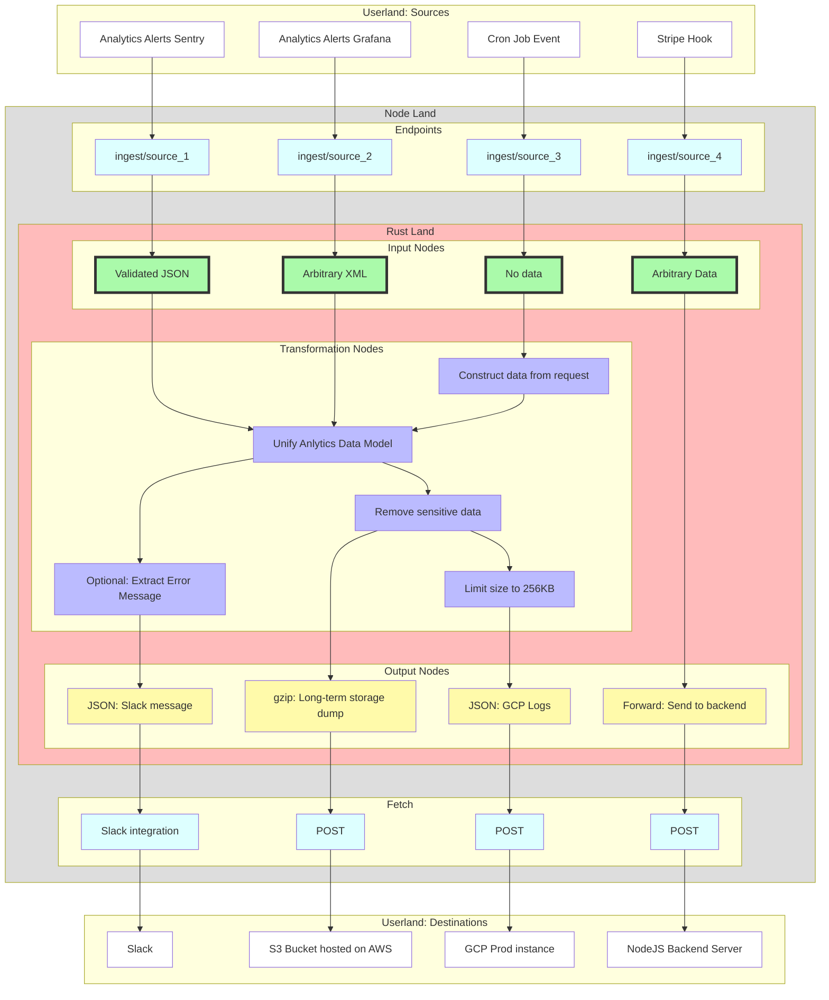

```mermaid
graph TD
subgraph "Userland: Sources"
	S1[Analytics Alerts Sentry]
	S2[Analytics Alerts Grafana]
	S3[Cron Job Event]
	S4[Stripe Hook]
end
subgraph SUB_N[Node Land]
	subgraph "Endpoints"
		E1[ingest/source_1]
		E2[ingest/source_2]
		E3[ingest/source_3]
		E4[ingest/source_4]
	end
	subgraph SUB_R["Rust Land"]
		subgraph "Input Nodes"
			I1[Validated JSON]
			I2[Arbitrary XML]
			I3[No data]
			I4[Arbitrary Data]
		end
		subgraph "Transformation Nodes"
			T1[Unify Anlytics Data Model]
			T2[Optional: Extract Error Message]
			T3[Remove sensitive data]
			T4[Limit size to 256KB]
			T5[Construct data from request]
		end
		subgraph "Output Nodes"
			O1[JSON: Slack message]
			O2[gzip: Long-term storage dump]
			O3[JSON: GCP Logs]
			O4[Forward: Send to backend]
		end
	end
	subgraph "Fetch"
		F1[Slack integration]
		F2[POST]
		F3[POST]
		F4[POST]
	end
end
subgraph "Userland: Destinations"
	D1[Slack]
	D2[S3 Bucket hosted on AWS]
	D3[GCP Prod instance]
	D4[NodeJS Backend Server]
end
	E1 --> I1
	E2 --> I2
	E3 --> I3
	E4 --> I4
	S4 --> E4

	S1 --> E1
	S2 --> E2
	S3 --> E3

	I1 --> T1
	I2 --> T1
	I3 --> T5
	I4 --> O4

	T1 --> T2
	T1 --> T3
	T2 --> O1
	T3 --> O2
	T3 --> T4
	T5 --> T1
	T4 --> O3

	O1 --> F1
	O2 --> F2
	O3 --> F3
	O4 --> F4

	F1 --> D1
	F2 --> D2
	F3 --> D3
	F4 --> D4
	
	style I1 fill:#AAFAAA,stroke:#333,stroke-width:4px
	style I2 fill:#AAFAAA,stroke:#333,stroke-width:4px
	style I3 fill:#AAFAAA,stroke:#333,stroke-width:4px
	style I4 fill:#AAFAAA,stroke:#333,stroke-width:4px

	style S1 fill:#DDDDDD
	style S2 fill:#DDDDDD
	style S3 fill:#DDDDDD
	style S4 fill:#DDDDDD

	style S1 fill:#FFFFFF
	style D1 fill:#FFFFFF
	style S2 fill:#FFFFFF
	style D2 fill:#FFFFFF
	style S3 fill:#FFFFFF
	style D3 fill:#FFFFFF
	style S4 fill:#FFFFFF
	style D4 fill:#FFFFFF

	style T1 fill:#BBBBFF
	style T2 fill:#BBBBFF
	style T3 fill:#BBBBFF
	style T4 fill:#BBBBFF
	style T5 fill:#BBBBFF

	style O1 fill:#FFFAAA
	style O2 fill:#FFFAAA
	style O3 fill:#FFFAAA
	style O4 fill:#FFFAAA

	style F1 fill:#DDFFFF
	style E1 fill:#DDFFFF
	style F2 fill:#DDFFFF
	style E2 fill:#DDFFFF
	style F3 fill:#DDFFFF
	style E3 fill:#DDFFFF
	style F4 fill:#DDFFFF
	style E4 fill:#DDFFFF

	style SUB_N fill:#DDDDDD
	style SUB_R fill:#FFBBBB

```
