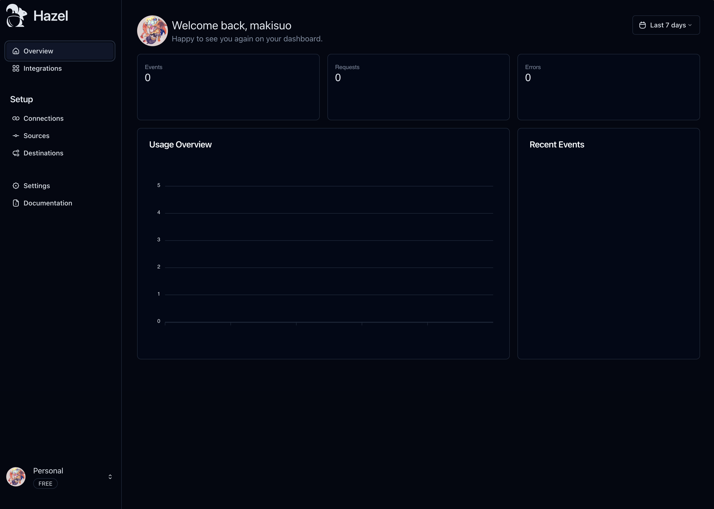

## Introducing Hazel

Hazel is your one-stop solution to streamline your webhook architecture. Webhooks, despite being a simple concept, 
come bundled with complexities—ranging from verifying signatures to rate limiting and handling retries. 
We're here to simplify these challenges for you.

## Why we build Hazel?

The creation of Hazel stems from our own frustrations. Time and time again, we grappled with similar challenges when integrating new webhook services,
knowing there must be a better way to approch this.
So we build Hazel to not need to worry about our webhook services anymore and have one place to monitor them all. 
Meaning now you can focus on actually implementing your business features and not worry about connecting webhooks to your business anymore.

## Current Features

Hazel offers a huge variety of features right out of the gate:

- *Admin Dashboard* for Monitoring, Usage Tracking and Configurations for all Webhooks
- *Ratelimiting* for Webhooks
- *Automatic Delay* and *Retries* 
- *Automatic Webhook Verification*
- A *CLI* to develop webhooks locally
- A simple *API* to easily integrate Hazel into your admin dashboards.

## Feature Deep Dive

### Admin Dashboard

Manage and monitor all your webhooks effortlessly from a unified dashboard, 
enabling swift identification and resolution of issues.

### Delay, Retries and Ratelimiting

Ratelimting, retries on failure and delays are an essantial part of webhook infrastrucutre but can be super unrealiable or
even none existant. Hazel provides a consistent delay, retry and ratelimting system for all webhook sources.

### Integrations and automaitc webhook verification

We provide very straightforward and easy to use intgerations for most popular webhook sources, but also provide simple solutions to verify other sources.
This way you will never have to worry about verifying your webhook on your server anymore, by just using one of Hazel's sdks.

### Simple Rest API

We provide a simple rest api to easily manage Webhooks aswell in your tech stack without ever needing to interact with Hazels ui.
You can create connections, destinations or connect new sources.

### Build for developers

We made it as simple as possible to also test your webhooks locally with the help of our cli to make developing with Hazel a breeze.

### Build with speed in mind

We've engineered Hazel with performance as one of the core principles. 
Our commitment to this principle means Hazel adds only a minimal latency (around 30-50ms) to your webhook requests, 
ensuring near real-time responses.

Rediscover the simplicity of webhooks with Hazel, and let us manage the complexities for you